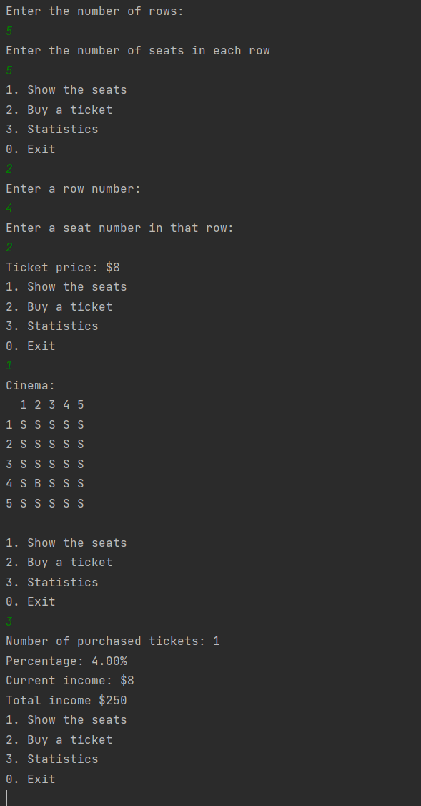

#Simple - Cinema Room Manager

## An application that helps manage a cinema theatre: sell tickets, check available seats and see sales statistics.

## Screenshot

## What I Learned
- Basic syntax of Java
- Variables
- Conditions
- Loops
- Methods
- User Input
- Multidimensional Arrays
- Iterating Arrays
- Logic
- Printing Data
- Switch Statement

